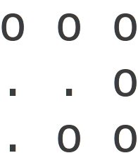
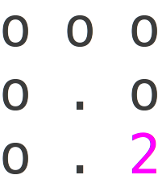

## Introduction

While looking at job announcements on LinkedIn, I found one particularly interesting
opening for an Algorithmic Trader. As part of the interview process I've been invited
to take part in a programming exam. I found one of the three problems quite entertaining.
Below I've rephrased the problem a bit so as to avoid the solutions be simply searchable
on the internet:
  
"Ms. Pac-Man has been placed onto the top level of cubic 3D labyrinth. The labyrinth consists
of $h$ levels divided into $m$ by $n$ areas each. Some areas have columns that support
ceiling, some areas are free. Ms. Pac-Man can move only to free areas laterally or between
the levels. Every move takes Ms. Pac-Man $5$ seconds. The pair of cherries is waiting for
Ms. Pac-Man at the lowest level. Write a program that helps Ms. Pac-Man to find the cherries
as fast as possible by finding the shortest path between them and outputting time this path
takes. The structure of the labyrinth is given bellow.
Ms. Pac-Man's location is marked with '$1$', the cherries’ location is marked with '$2$'.
'$.$' - marks a free spot and '$o$' marks a column."

--- .class #id

## Example of a simple labyrinth

Level 0:
 

 
Level -1:
 

 
Level -2:
 

 

--- .class #id

## Solution strategies

There are several ways to solve this problem, I thought of at least two:

* Dynamic programming approach (an overview by Tim Roughgarden in his [course](https://class.coursera.org/algo2-003/lecture))
 * calculate a minimal time (score) needed to reach every point in the labyrinth
 * construct the path by backtracking from the destination using this score

* Classical Dijkstra's shortest path on the graph
 * every position in the labyrinth is a node connected by unit edges with its neighbors
 * use Dijkstra algorithm as is on this graph

--- .class #id

## Dynamic programming approach

Setup: Let $A$ = 3-D array (indexed by $x$, $y$, $z$);  $x\subset[1..n]$, $y\subset[1..m]$, and $z\subset[1..l]$

Intent: $A[x,y,z]$ - length of the shortest path between ($x_0$,$y_0$,$z_0$) and any ($x$,$y$,$z$) 
<!--in the labyrinth (or $+\infty$ if no such path exists)-->

Initialization:
$$
A[x,y,z] = \left\{\begin{array}{lll}
0 ~~\text{if}~~ x=x_0, y=y_0, z=z_0 \\
5 ~~\text{if}~~ x,y,z ~~\text{is one step away from}~~ x_0,y_0,z_0 \\
+\infty ~~\text{otherwise}
\end{array}
\right.
$$

Iteration: Repeat the code below until a new iteration doesn't change $A$:
$$
\begin{array}{lll}
 \text{For}~~ x = 1 ~~\text{to}~~ n \\
 ~~\text{For}~~ y = 1 ~~\text{to}~~ m \\
 ~~~~\text{For}~~ z = 1 ~~\text{to}~~ l
\end{array}
$$
$$
 A[x,y,z] = MIN( A[x,y,z], A[x^\prime,y^\prime,z^\prime] + 5 ~~\forall~~ x^\prime,y^\prime,z^\prime ~~\text{neighbors of}~~ x,y,z )
$$

(consider only allowed positions in the labyrinth, i.e. avoid '$o$')

--- .class #id

## Analysis

Running time:
$\mathcal{O}(n\times m\times l \times (n+m+l))$

We can do slightly better by breaking the outer loop first time we reach the destination.
Every move in the labyrinth costs the same time, i.e. no shorter path can be built with elements
that will be reached after we reach the destination.

Implementation can be found in [labyrinthDynamic.cc](https://github.com/koskot77/tmg/blob/master/labyrinthDynamic.cc) 

Can we do better? Yes we can: Dijkstra's shortest path

--- .class #id

## Dijkstra's shortest path

Preprocessing step: Turn the labyrinth into a graph in adjacent representation
 * convert every allowed $(x,y,z)$ coordinate into a node labeled with a unique number
 * connect neighboring nodes with edges

Computation step: run Dijkstra's greedy algorithm

Running time:
Dijkstra's takes $\mathcal{O}(\text{number of nodes} ~~+~~ \text{number of edges})$

Number of edges is $\mathcal{O}(\text{number of nodes})$, number of nodes is $\mathcal{O}(n\times m\times l)$

Implementation can be found in [labyrinthDijkstra.cc](https://github.com/koskot77/tmg/blob/master/labyrinthDijkstra.cc) 

