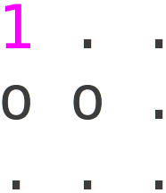

## Introduction

While looking at job announcements on LinkedIn, I found one particularly interesting
opening for an Algorithmic Trader. As part of the interview process I've been invited
to take part in a programming exam. I found one of the three problems quite entertaining.
Below I've rephrased the problem a bit so as to avoid the solutions be simply searchable
on the internet:
  
"Ms. Pac-Man has been placed onto the top level of cubic 3D labyrinth. The labyrinth consists
of $h$ levels divided into $m$ by $n$ areas each. Some areas have columns that support
ceiling, some areas are free. Ms. Pac-Man can move only to free areas laterally or between
the levels. Every move takes Ms. Pac-Man $5$ seconds. The pair of cherries is waiting for
Ms. Pac-Man at the lowest level. Write a program that helps Ms. Pac-Man to find the cherries
as fast as possible by finding the shortest path between them and outputting time this path
takes. The structure of the labyrinth is given bellow.
Ms. Pac-Man's location is marked with '$1$', the cherries’ location is marked with '$2$'.
'$.$' - marks a free spot and '$o$' marks a column."

--- .class #id

## Example of a simple labyrinth

Level 0:
 

 
Level -1:
 

 
Level -2:
 

 

--- .class #id

## Solution strategies

There are several ways to solve this problem, I thought of at least two:

* Dynamic programming approach (an overview by Tim Roughgarden in his [course](https://class.coursera.org/algo2-003/lecture))
 * calculate a minimal time (score) needed to reach every point in the labyrinth
 * construct the path by backtracking from the destination using this score

* Canonical BFS, Dijkstra's, or Bellman-Ford shortest path algorithms on the graph
 * every position in the labyrinth is a node connected by unit edges with its neighbors
 * use any of the canonical shortest-path algorithms as is on this graph

--- .class #id

## Dynamic programming approach

Setup: Let $A$ = 3-D array (indexed by $x$, $y$, $z$);  $x\subset[1..n]$, $y\subset[1..m]$, and $z\subset[1..l]$

Intent: $A[x,y,z]$ - length of the shortest path between ($x_0$,$y_0$,$z_0$) and any ($x$,$y$,$z$) 
<!--in the labyrinth (or $+\infty$ if no such path exists)-->

Initialization:
$$
A[x,y,z] = \left\{\begin{array}{lll}
0 ~~\text{if}~~ x=x_0, y=y_0, z=z_0 \\
5 ~~\text{if}~~ x,y,z ~~\text{is one step away from}~~ x_0,y_0,z_0 \\
+\infty ~~\text{otherwise}
\end{array}
\right.
$$

Iteration: Repeat the code below until a new iteration doesn't change $A$:
$$
\begin{array}{lll}
 \text{For}~~ x = 1 ~~\text{to}~~ n \\
 ~~\text{For}~~ y = 1 ~~\text{to}~~ m \\
 ~~~~\text{For}~~ z = 1 ~~\text{to}~~ l
\end{array}
$$
$$
 A[x,y,z] = MIN( A[x,y,z], A[x^\prime,y^\prime,z^\prime] + 5 ~~\forall~~ x^\prime,y^\prime,z^\prime ~~\text{neighbors of}~~ x,y,z )
$$

(consider only allowed positions in the labyrinth, i.e. avoid '$o$')

--- .class #id

## Analysis

Running time:
$\mathcal{O}(n\times m\times l \times (n+m+l))$

We can do slightly better by breaking the outer loop first time we reach the destination.
Every move in the labyrinth costs the same time, i.e. no shorter path can be built with elements
that will be reached after we reach the destination.

Implementation can be found in [labyrinthDynamic.cc](https://github.com/koskot77/tmg/blob/master/labyrinthDynamic.cc) 

Can we do better? Yes we can: shortest path on a graph

--- .class #id

## Canonical graph path algorithms

Preprocessing step: Turn the labyrinth into a graph in adjacent list representation
 * convert every allowed $(x,y,z)$ coordinate into a node labeled with a unique number
 * connect neighboring nodes with edges of 5 units weight 

Computation step: run Breadth First Search or Dijkstra's greedy algorithms or Bellman-Ford

Best running time is for BFS:
$\mathcal{O}(\text{number of nodes} ~~+~~ \text{number of edges})$

Number of edges is $\mathcal{O}(\text{number of nodes})$, number of nodes is $\mathcal{O}(n\times m\times l)$

Although these algorithms are readily available (e.g. references in $\mathcal{15.4}$ of [Skiena's Algorithm Design Manual](http://sist.sysu.edu.cn/~isslxm/DSA/textbook/Skiena.-.TheAlgorithmDesignManual.pdf)), I'll briefly summarize a pseudo-code implementation in the following slides

A more detailed review of these algorithms can be found in Tim Roughgarden's [course](https://class.coursera.org/algo-004/lecture/preview)

--- .class #id

## Breadth First Search (BFS) algorithm application

Intent: Find shortest paths from the origin node $s$ to every other node of the graph

Setup: Let $d(v)$ is a distance from $s$ to $v$ and $FIFO$ is a queue of nodes to be explored

Initialization: Label $s$ explored and put $s$ in $FIFO$; 
set $d(\forall)=\infty$ and $d(s)=0$

Iteration: Until the $FIFO$ is not empty:
* remove next node from the $FIFO$, call it $v$
* for each edge($v$,$w$)
    + if $w$ is not explored
        + label $w$ as explored
        + $d(w) = d(v) + 5$
        + add $w$ to the end of $FIFO$

Implementation (in python for a change) can be found in [labyrinthBFS.py](https://github.com/koskot77/tmg/blob/master/labyrinthBFS.py)

--- .class #id

## Dijkstra's Shortest Path Algorithm

Application: Unlike BFS, Dijkstra's algorithm can handle any arbitrary positive edge lengths

Setup: Let $X$ is a set of explored vertices; $d(v)$ and $p(v)$ is distance and path from $s$ to $v$

Initialization: $X = \{s\}$, $~d(s)=0$, $~p(s)=\{\}$

Iteration: Until $X \ne V$ (i.e. there are unexplored vertices left) 
* for each edge($v$,$w$), where $v \in X$ and $w \notin X$
    + pick the one that minimizes $d(v) + d_{vw}$ ($d_{vw}$ - distance between $v$ and $w$)
    + call the nodes $v^\ast$ and $w^\ast$
* add $w^\ast$ to $X$
* set $d(w^\ast) = d(v^\ast) + d_{v^\ast w^\ast}$
* set $p(w^\ast) = p(v^\ast) \cup (v^\ast,w^\ast)$

A straitforward implementation (not using heaps) can be found in [labyrinthDijkstra.cc](https://github.com/koskot77/tmg/blob/master/labyrinthDijkstra.cc)

--- .class #id

## Summary

* Among all of the textbook approaches described above, in the time allowed time for the exam I demonstrated only
the dynamic programming solution (the hardest, given I had no implementation ready to be used for the problem)

* Perhaps, I did well enough to receive a call back for the phone interview

* In the phone interview I was relatively comfortable with technical topics, but I made it clear that I have
no experience in the world of finance

* The phone interview was the last interaction with the company, still no bad feeling: I'm glad I had this
opportunity to exercise my Computer Science skills

--- .class #id

   

\[ \Large Backup \]

--- .class #id

## A smarter approach to the Dijkstra's Algorithm

Dijkstra's running time $\mathcal{O}(\text{mn})$ can reduce to $\mathcal{O}(\text{m}~~log(\text{n}))$ if one uses heap
(note here $\text{m}$ - number of edges and $\text{n}$ - number of nodes)

Setup: $X$ accumulates explored nodes with distances to $s$; $h$ is a heap of unexplored nodes

Initialization: $X = \{\}$; $h$ rooted at $s$ (key=0), filled randomly with remaining nodes (keys=$\infty$)

Iteration: Unless all nodes are explored:

* $v, key = h.extractMin()$
* add $v$ to $X$, set $X[v] = key$
* for each edge($v$,$w$), where $w \notin X$
    + $key^\ast = h.delete( w )$
    + $key^\ast = min( key^\ast, key + d_{vw} )$ ($d_{vw}$ - distance between $v$ and $w$)
    + $h.insert( w, key^\ast )$

Implementation can be found in [labyrinthDijkstra.py](https://github.com/koskot77/tmg/blob/master/labyrinthDijkstra.py)

--- .class #id

## Depth First Search (DFS) algorithm

DFS algorithm often mentioned with BFS algorithm, but it doesn't compute shortest path

Instead it has different applications (e.g. strongly connected components of directed graphs)

Because it is very simple, I also summarize the implementation of the DFS algorithm below:

Setup: Same as for BSF expect using stack (implicitly via recursion) instead of $FIFO$:

$DFS(\text{Graph}~G, \text{start node}~s)$
* label $s$ as explored
* for each edge($s$,$v$):
    + if $v$ is not explored
        + $DFS(G,v)$

